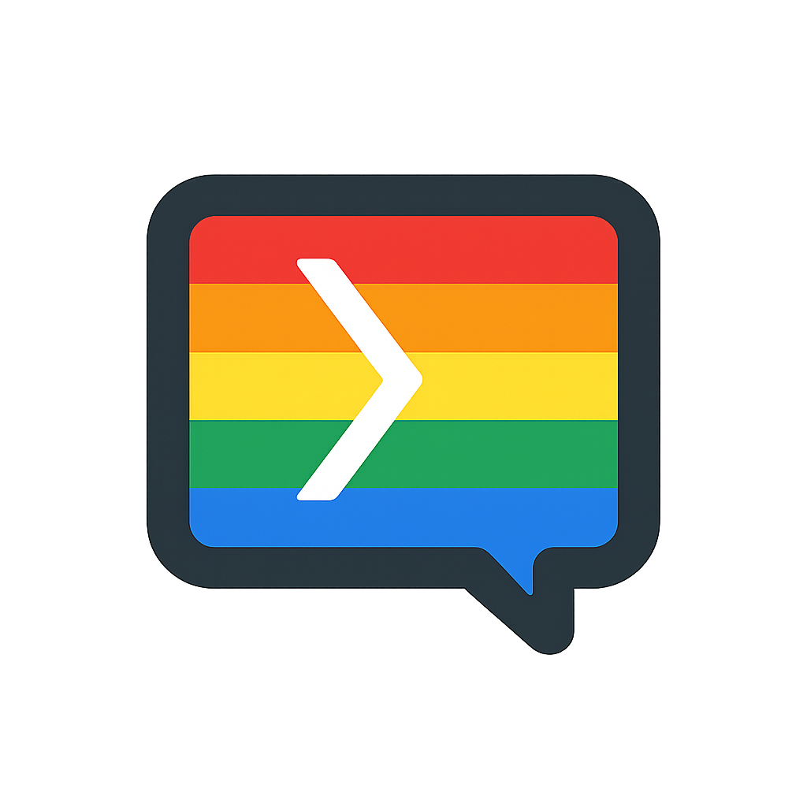

# ChromaText 🌈

A Discord app that converts messages into colorful ANSI-formatted text blocks! Perfect for making your important messages stand out or adding some flair to your Discord server.

<p align="center">

</p>

<p align="center">
<a href="https://opensource.org/licenses/MIT"></a>
<a href="https://discord.com/oauth2/authorize?client_id=1356766929800532281"></a>
</p>

## Features

- **Slash Command**: Use `/chroma` to create custom colored text
- **Context Menu**: Right-click any message and select "Colorize Text" to transform it
- **Formatting Options**: Choose from normal, bold, or underlined text
- **Color Choices**: 8 text colors and 8 background colors to mix and match
- **Mobile-Friendly Mode**: Optional streamlined output for easier copy-pasting on mobile devices

## Installation

You can easily add ChromaText to your apps or server by clicking [here](https://discord.com/oauth2/authorize?client_id=1356766929800532281). However, if you're interested in contributing, or maybe creating your own version of ChromaText, then you can do so by following the guide below.

### Requirements

- Python 3.8+
- Discord.py v2.0+
- python-dotenv

### Setup

1. **Clone the repository**

   ```bash
   git clone https://github.com/lsalik2/chromatext.git
   cd chroma-text
   ```

2. **Install dependencies**

   ```bash
   pip install -r requirements.txt
   ```

3. **Create a Discord bot**
   - Go to [Discord Developer Portal](https://discord.com/developers/applications)
   - Create a new application
   - Add a bot to your application
   - Copy your bot token under the "Bot" tab

4. **Configure environment variables**
   - Create a `.env` file in the project directory
   - Add your Discord bot token:

     ```md
     DISCORD_TOKEN=your_token_here
     ```

5. **Invite the bot to your server**
   - Go to OAuth2 > URL Generator in the Discord Developer Portal
   - Select scopes: `bot`, `applications.commands`
   - Select permissions: `Send Messages`, `Use Slash Commands`
   - Use the generated URL to invite the bot to your server

6. **Run the bot**

   ```bash
   python bot.py
   ```

## Usage

### Slash Command

Use the `/chroma` command with the following parameters:

- `message`: The text you want to colorize
- `format`: Choose text formatting (Normal, Bold, Underline)
- `background_color`: Select a background color
- `text_color`: Select a text color
- `mobile_friendly`: (Optional) Simplified output for mobile users

### Context Menu

1. Right-click on any message
2. Select Apps > Colorize Text
3. Choose your formatting options from the dropdown menus
4. Click "Submit"
5. The selection UI will disappear and be replaced with your colorized text

## ANSI Colors Reference

### Text Colors

- Blue (34)
- Cyan (36)
- Green (32)
- Grey (30)
- Pink (35)
- Red (31)
- White (37)
- Yellow (33)

### Background Colors

- Dark Blue (40)
- Dark Grey (42)
- Grey (43)
- Indigo (45)
- Light Grey (44)
- Orange (41)
- Silver (46)
- White (47)

## Contributing

Contributions are welcome! Please feel free to submit a Pull Request.

1. Fork the repository
2. Create your feature branch (`git checkout -b feature/amazing-feature`)
3. Commit your changes (`git commit -m 'Add some amazing feature'`)
4. Push to the branch (`git push origin feature/amazing-feature`)
5. Open a Pull Request

## License

This project is licensed under the MIT License - see the [LICENSE](LICENSE) file for details.

## Acknowledgments

- [A guide to ANSI on Discord](https://gist.github.com/kkrypt0nn/a02506f3712ff2d1c8ca7c9e0aed7c06#text-colors) by kkrypt0nn
- The Discord.py team for their excellent library
- All contributors who help improve ChromaText

## Support

If you need help with setup or have questions, please open an issue on GitHub or message **slk** on Discord).
