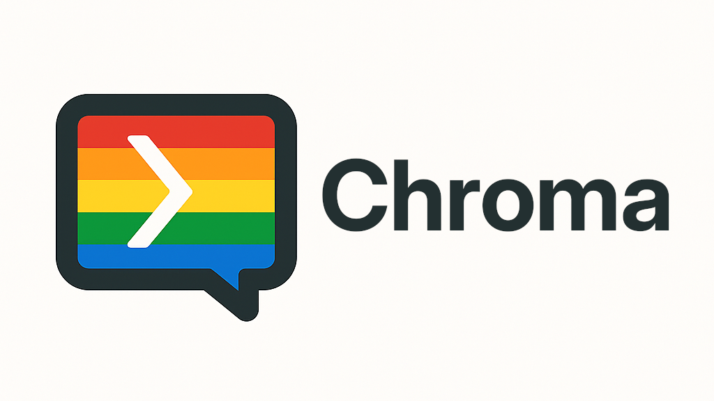

<p align="center">

</p>

A Discord utility app that can convert messages into colorful ANSI-formatted text blocks, translates messages between languages, and more! Perfect for making your important messages stand out, adding some flair to your Discord server, or communicating with users who speak different languages.

<p align="center">
<a href="https://opensource.org/licenses/MIT"></a>
<a href="https://discord.com/oauth2/authorize?client_id=1356766929800532281"></a>
</p>

## Features

- **Text Formatting**
  - **Slash Command**: Use `/chroma` to create custom colored text
  - **Context Menu**: Right-click any message and select "Colorize Text" to transform it
  - **Formatting Options**: Choose from normal, bold, or underlined text
  - **Color Choices**: 8 text colors and 8 background colors to mix and match
  - **Mobile-Friendly Mode**: Optional streamlined output for easier copy-pasting on mobile devices

- **Translation**
  - **Slash Command**: Use `/translate` to translate text to another language
  - **Context Menu**: Right-click any message and select "Translate" to translate it
  - **Language Options**: Choose from 10 popular languages including English, Spanish, French, and more
  - **Auto-Detection**: Automatically detects the source language of the message

## Installation

You can easily add Chroma to your apps or server by clicking [here](https://discord.com/oauth2/authorize?client_id=1356766929800532281). However, if you're interested in contributing, or maybe creating your own version of Chroma, then you can do so by following the guide below.

### Requirements

- Python 3.8+
- Discord.py v2.0+
- python-dotenv
- googletrans==4.0.2

### Setup

1. **Clone the repository**

   ```bash
   git clone https://github.com/lsalik2/chroma.git
   cd chroma
   ```

2. **Install dependencies**

   ```bash
   pip install -r requirements.txt
   ```

3. **Create a Discord bot**
   - Go to [Discord Developer Portal](https://discord.com/developers/applications)
   - Create a new application
   - Add a bot to your application
   - Copy your bot token under the "Bot" tab

4. **Configure environment variables**
   - Create a `.env` file in the project directory
   - Add your Discord bot token:

     ```md
     DISCORD_TOKEN=your_token_here
     ```

5. **Invite the bot to your server**
   - Go to OAuth2 > URL Generator in the Discord Developer Portal
   - Select scopes: `bot`, `applications.commands`
   - Select permissions: `Send Messages`, `Use Slash Commands`
   - Use the generated URL to invite the bot to your server

6. **Run the bot**

   ```bash
   python bot.py
   ```

## Usage

### Text Formatting

#### /chroma Command

Use the `/chroma` command with the following parameters:

- `message`: The text you want to colorize
- `format`: Choose text formatting (Normal, Bold, Underline)
- `background_color`: Select a background color
- `text_color`: Select a text color
- `mobile_friendly`: (Optional) Simplified output for mobile users

#### "Colorize" Context Menu

1. Right-click on any message
2. Select Apps > Colorize Text
3. Choose your formatting options from the dropdown menus
4. Click "Submit"

### Translation

#### /translate Command

Use the `/translate` command with the following parameters:

- `text`: The text you want to translate
- `language`: The target language to translate to

#### "Translate" Context Menu

1. Right-click on any message
2. Select Apps > Translate
3. Choose your target language from the dropdown menu
4. Click "Submit"

## ANSI Format/Colors Reference

| Formats       | Text Colors | Background Colors |
|---------------|-------------|-------------------|
| Normal (0)    | Grey (30)   | Dark Blue (40)    |
| Bold (1)      | Red (31)    | Orange (41)       |
| Underline (4) | Green (32)  | Dark Grey (42)    |
|               | Yellow (33) | Grey (43)         |
|               | Blue (34)   | Light Grey (44)   |
|               | Pink (35)   | Indigo (45)       |
|               | Cyan (36)   | Silver (46)       |
|               | White (37)  | White (47)        |

## Supported Languages

| Language | Code |
|----------|------|
| English | en |
| Spanish | es |
| French | fr |
| German | de |
| Italian | it |
| Portuguese | pt |
| Russian | ru |
| Japanese | ja |
| Chinese (Simplified) | zh-cn |
| Arabic | ar |

## Contributing

Contributions are welcome! Please feel free to submit a Pull Request.

1. Fork the repository
2. Create your feature branch (`git checkout -b feature/amazing-feature`)
3. Commit your changes (`git commit -m 'Add some amazing feature'`)
4. Push to the branch (`git push origin feature/amazing-feature`)
5. Open a Pull Request

## License

This project is licensed under the MIT License - see the [LICENSE](LICENSE) file for details.

## Acknowledgments

- [A guide to ANSI on Discord](https://gist.github.com/kkrypt0nn/a02506f3712ff2d1c8ca7c9e0aed7c06#text-colors) by kkrypt0nn
- The Discord.py team for their excellent library
- The googletrans library for translation functionality
- All contributors who help improve Chroma

## Support

If you need help with setup or have questions, please open an issue on GitHub or message **slk** on Discord.
